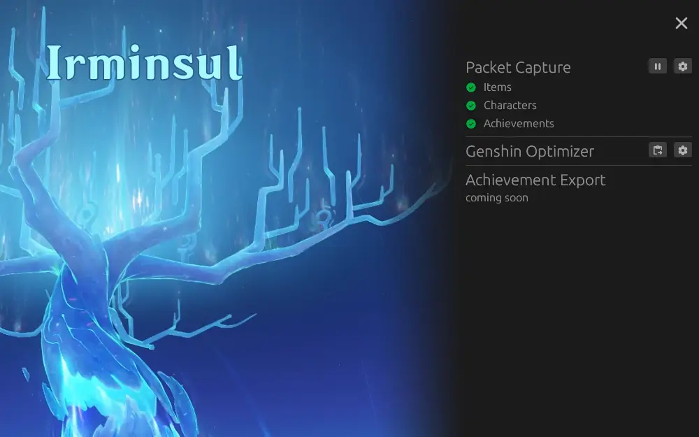

# Irminsul

Irminsul is a utility to export data from Genshin Impact to Genshin Optimizer.
It is a early work in progress. Please see the feature list and instructions
below.

## Features

- [x] Automatically download up to data game data.
- [x] Capture packets w/o needing npcap installed.
- [x] Monitor real-time network traffic for data updates.
- [x] Export data to genshin optimizer format.
- [x] Export filter settings.
- [ ] Handle data updates after initial game start.
- [ ] Detect game session ending and new sessions beginning.
- [x] Auto-updated mechanism.
- [ ] Log exporting for bug reporting
- [ ] Export achievements
- [ ] Export pull history
- [x] UI rework (aka make it purdy)

## Use

- Launch Irminsul before launching Genshin Impact.
- On first launch or when new data is available you will be asked to confirm its
  download.
- You will be asked to allow the application to make changes to your computer.
  This is necessary to be able to capture the network traffic from Genshin.
- Click on the play button next in the`Packet Capture` section.
- Launch Genshin and enter the game (i.e. "enter the door").
- You should see the data sources under `Packet Capture` makred with green check marks.
- Click export button under the `Genshin Optimizer` section.
- Click `Copy To Clipboard` on the popup.
- Filters for what data gets exported are accessible through the settings button
  (gear icon) in the `Genshin Optimizer` section.
